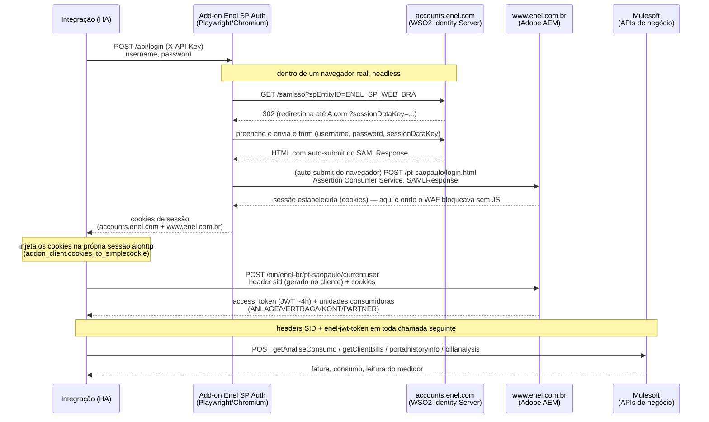

# Documentação técnica

> Este documento é voltado para quem quer entender ou contribuir com a
> implementação. Para instalar e usar a integração, veja o [README](README.md).

Detalhes de implementação da integração não-oficial (HACS) da Enel São Paulo:
de onde vem cada campo, como funciona o login SAML de
[www.enel.com.br/pt-saopaulo](https://www.enel.com.br/pt-saopaulo/login.html)
e por que parte desse login roda dentro do add-on **Enel SP Auth**
(Playwright), não na própria integração.

Não possui nenhum vínculo com a Enel. Use por sua conta e risco — é engenharia
reversa de uma API não documentada, que pode mudar sem aviso.

## Entidades criadas por unidade consumidora

- **Última fatura fechada** (`sensor`, R$) — valor e vencimento da conta em aberto mais recente.
- **Consumo do período** (`sensor`, kWh) — consumo do ciclo de faturamento atual.
- **Bandeira tarifária** (`sensor`) — verde / amarela / vermelha 1 / vermelha 2.
- **Medidor inteligente** (`binary_sensor`, diagnóstico) — indica se a UC tem smart meter.
- **Data da leitura atual** / **Data da próxima leitura** (`sensor`, timestamp).
- **Próxima atualização** (`sensor`, timestamp, diagnóstico) — horário estimado
  do próximo ciclo automático (`coordinator.next_update`), calculado a partir
  de `next_reading_date + 1 dia` (ver "Periodicidade da atualização" abaixo).
  Não muda com um refresh manual pelo botão.
- **Valor do medidor atual** (`sensor`, kWh, sem casas decimais) — leitura do
  registrador do medidor.
- **Valor do medidor anterior** (`sensor`, kWh, sem casas decimais) — calculado
  (leitura atual menos o consumo do período atual, arredondado), pois a API
  não devolve esse valor diretamente.
- **Link da fatura em PDF** (`sensor`, diagnóstico) — URL local pra abrir o PDF
  da fatura mais recente direto do navegador. **Leia o aviso de segurança
  abaixo antes de usar.**
- **Código Pix** (`sensor`) — o "copia e cola" da fatura em aberto, quando a
  Enel disponibiliza um pra ela. Some quando não há fatura pendente (mesmo
  critério do "Status da conta" abaixo).
- **QR Code Pix** (`image`) — a mesma informação do sensor acima, renderizada
  como QR Code (gerado localmente pela integração com a lib `qrcode`, a
  Enel não manda uma imagem pronta). Fica indisponível pelo mesmo motivo que
  o sensor de texto some: sem fatura pendente, não há o que mostrar.
- **Status da conta** (`sensor`) — `Em aberto` se **qualquer** fatura
  consultada estiver pendente (não só a mais recente), senão `Paga`.
  Atributos: `quantidade_pendentes`, `valor_total_pendente`,
  `meses_pendentes`.
- **Total de contas em aberto** (`sensor`) — quantidade de faturas pendentes
  entre todas as consultadas; mesmo critério e mesmo número do atributo
  `quantidade_pendentes` acima, como sensor próprio (útil pra automações
  sem precisar ler um atributo).
- **Fornecimento normal** (`binary_sensor`, diagnóstico) — `ligado` quando o
  fornecimento está normal, `desligado` quando há corte por falta de
  pagamento. Atributo `mensagem` quando disponível.
- **Mensagem de análise da fatura** (`sensor`) — resumo da Enel sobre a
  variação da conta mais recente (ex.: "Você gastou R$ 10,55 a menos que o
  mês anterior...").
- **Consumo médio diário** (`sensor`, kWh/d) e **Gasto médio diário**
  (`sensor`, R$/d) — médias do ciclo de faturamento mais recente.
- **Atualizar dados** (`button`, config) — força uma atualização imediata,
  sem esperar o próximo ciclo agendado (ver "Periodicidade da atualização"
  abaixo). O estado do próprio botão já é o horário do último aperto manual
  (padrão do HA); o atributo `ultima_atualizacao` guarda o horário da última
  atualização bem-sucedida, seja manual (por esse botão) ou automática (do
  ciclo periódico).

O sensor de consumo traz em `historico` os últimos meses de consumo (kWh) e valor
(R$) faturado, úteis para gráficos.

O `entity_id` de cada entidade segue o padrão `<domínio>.enel_sp_<login antes
do "@">_<chave>` (`domínio` é `sensor`, `binary_sensor`, `button` ou `image`) — por
exemplo, para o login `fulano@example.com`, a última fatura fechada fica em
`sensor.enel_sp_fulano_valor_ultima_fatura_fechada`, o fornecimento normal em
`binary_sensor.enel_sp_fulano_fornecimento_normal` e o botão de atualizar em
`button.enel_sp_fulano_atualizar_dados`. Se o login for CPF (sem `@`), usa
ele inteiro. Essa formatação só vale na primeira vez que a entidade é
criada; depois disso, renomear pela UI do HA é respeitado normalmente.

## De onde vêm os dados de cada sensor

Todas as chamadas usam o token (`enel-jwt-token`) e o `SID` obtidos no login.
As três primeiras vêm de uma leva de chamadas feita a cada atualização; o
`billanalysis` roda em seguida, sobre a fatura mais recente encontrada no
`getClientBills`.

**Faturas: `getClientBills`, não `portalinfo`.** O `portalinfo` também
devolve `ET_CONTAS[]`, mas sem o campo `QRCODE` — por isso o Código Pix nunca
vinha preenchido. O `getClientBills` devolve o mesmo formato de item (`BELNR`,
`SITUACAO`, `VENCIMENTO`, `ANO_MES_REF`, `MONTANTE`, `O_COD_BARRAS`, etc.) só
que com `QRCODE` populado, então substituiu o `portalinfo` como fonte de
`ET_CONTAS[]` (parâmetro extra: `I_QTDE_FAT: "99"`, quantidade de faturas a
retornar).

| Sensor (chave) | Endpoint (`Funcionalidad`) | Campo(s) de origem |
|---|---|---|
| Última fatura fechada (`valor_ultima_fatura_fechada`) | `getClientBills` | `ET_CONTAS[]` com `SITUACAO != "Paga"` (a mais recente por `VENCIMENTO`) → `MONTANTE`. Atributos: `VENCIMENTO`, `SITUACAO`, `ANO_MES_REF`, `COD_BARRAS_NOVO`/`O_COD_BARRAS` |
| Consumo do período (`consumo_periodo_atual`) | `getAnaliseConsumo` | `ET_INSTALACAO[]` (item com `ANLAGE` da UC) → `ATUAL_CONSUMO`. Atributos: `PERIODO` (mesma resposta) e `historico` (de `portalhistoryinfo` → `ET_MEDIA_CONS`) |
| Bandeira tarifária (`bandeira_tarifaria`) | `currentuser` | `E_BANDEIRA` |
| Medidor inteligente (`medidor_inteligente`, `binary_sensor`) | `currentuser` | `ET_INST[].SMARTMETER == "X"`. Atributo `numero_serie`: `ET_INST[].SERIE` |
| Data da leitura atual (`data_leitura_atual`) | `billanalysis` | `E_DT_LEITURA_ATUAL` (`YYYYMMDD`) |
| Data da próxima leitura (`data_proxima_leitura`) | `billanalysis` | `E_PROX_LEIT` (texto tipo "10 de Setembro", sem ano — o ano é calculado a partir de `E_DT_LEITURA_ATUAL`) |
| Valor do medidor atual (`valor_medidor_atual`) | `billanalysis` | `ET_MENU_RAPIDO[]` (item `ID == "LEITATUAL"`) → `VALOR2` |
| Valor do medidor anterior (`valor_medidor_anterior`) | `billanalysis` + `getAnaliseConsumo` | **Calculado**, não vem pronto: `VALOR2 - ATUAL_CONSUMO`, arredondado. Usa o mesmo `ATUAL_CONSUMO` do sensor "Consumo do período" (não `E_CONS_TOTAL`/`E_CONSTANTE` do `billanalysis`, que se referem ao ciclo de faturamento da última fatura, não ao período atual) |
| Link da fatura em PDF (`link_fatura_pdf`) | `generatepdf` | `E_BIN_FAT` (PDF em base64, decodificado e salvo em disco) — veja a seção abaixo |
| Código Pix (`codigo_pix`) | `getClientBills` | Mesmo item de `ET_CONTAS[]` da última fatura fechada → campo `QRCODE`. `None` se `next_due_bill` for `None` (nenhuma fatura com `SITUACAO != "Paga"`) — não basta o campo `QRCODE` existir na fatura, ela também precisa estar pendente (a Enel manda `QRCODE` até em faturas já pagas). Se passar de 255 caracteres (limite de estado do HA), o valor completo vai pro atributo `codigo_completo` |
| QR Code Pix (`qrcode_pix`, `image`) | — | Não chama a API: gera a imagem localmente (lib `qrcode`) a partir do mesmo texto do sensor "Código Pix" acima. Mesmo gate: sem `next_due_bill`, a entidade fica `unavailable` |
| Status da conta (`status_conta`) | `getClientBills` | Todo o `ET_CONTAS[]` (não só a mais recente) — `"Em aberto"` se algum item tiver `SITUACAO != "Paga"`, senão `"Paga"` |
| Total de contas em aberto (`total_contas_abertas`) | `getClientBills` | Mesmo filtro do "Status da conta" (`ET_CONTAS[]` com `SITUACAO != "Paga"`) → `len(...)` |
| Fornecimento normal (`fornecimento_normal`, `binary_sensor`) | `getAnaliseConsumo` | `ET_INSTALACAO[]` → `SUSPENSA != "X"` (invertido: `ligado` = normal). Atributo `mensagem`: `MSG_SUSPENSAO` |
| Mensagem de análise da fatura (`mensagem_analise_fatura`) | `billanalysis` | `E_MSG`/`DescripcionResultado` |
| Consumo médio diário (`consumo_medio_diario`) | `billanalysis` | `E_CONS_DIA` |
| Gasto médio diário (`gasto_medio_diario`) | `billanalysis` | `E_VALOR_DIA` |

A **fatura usada no `billanalysis` e no `generatepdf`** é sempre a de maior
`VENCIMENTO` dentro de `ET_CONTAS` (não a posição 0 do array — a API não
garante essa ordem).

O campo `QRCODE` é o mesmo que o site oficial usa para renderizar o QR Code
de pagamento (`chosenBill.QRCODE` no código-fonte deles). Confirmado numa
captura real que ele vem preenchido tanto em faturas pendentes quanto pagas;
se mesmo assim o sensor ficar vazio com uma fatura em aberto, pode ser que
essa conta/UC específica não tenha Pix habilitado pelo lado da Enel.

## Link da fatura em PDF — aviso de segurança

O PDF é salvo em `config/www/enel_sp/<anlage>.pdf` e o sensor guarda o
caminho relativo `/local/enel_sp/<anlage>.pdf` (sem host — o navegador
resolve em cima da origem de onde você estiver acessando o HA no momento).
O Home Assistant serve automaticamente tudo que está em `config/www/` nesse
caminho **sem exigir login** — é o mesmo mecanismo usado por outras
integrações para expor fotos de câmera, por exemplo, não é uma falha
específica desta integração.

Na prática isso quer dizer que **qualquer um com acesso à rede/porta do seu
HA consegue abrir esse link e ver a fatura** (nome, endereço, valores, código
de barras) sem entrar na sua conta do HA. Se sua instância estiver acessível
pela internet sem proteção adicional (proxy reverso com autenticação própria,
VPN, Nabu Casa com esse detalhe em mente, etc.), avalie se quer mesmo manter
esse sensor habilitado — dá pra desabilitá-lo em Configurações → Entidades.

Cada atualização substitui o arquivo pelo PDF da fatura mais recente daquele
momento; o nome do arquivo (`<anlage>.pdf`) é fixo por unidade consumidora,
então o link não muda com o tempo.

## Periodicidade da atualização

A atualização automática **não é diária**: a cada atualização bem-sucedida,
`coordinator._async_update_data()` recalcula `self.update_interval` chamando
`api.compute_next_update_interval(data.next_reading_date)`, que agenda a
próxima para `next_reading_date + 1 dia` (a data da próxima leitura do
medidor, informada pela própria Enel via `billanalysis` → `E_PROX_LEIT`). Na
prática isso roda em torno de **uma vez por ciclo de faturamento (~30
dias)**, não a cada poucas horas.

Isso é proposital: reduz a frequência de logins automatizados e, com isso, o
risco de o WAF da Enel escalar a resposta a esses logins (ver "Fluxo de
login" abaixo). Cai de volta para `const.DEFAULT_UPDATE_INTERVAL` (24h) só
como *fallback*, quando `next_reading_date` não vem informado ou quando o
alvo calculado já ficaria no passado (dado desatualizado).

Isso vale só para o polling automático — o botão **Atualizar dados** sempre
força uma atualização imediata, fora desse agendamento.

## Painel de Energia (removido)

Até uma versão anterior, UCs com medidor inteligente tinham o consumo
horário/mensal (`smartmetergetconsumptionchartdata`) enviado como estatística
de longo prazo para o Painel de Energia do HA. Essa funcionalidade foi
removida: exigia chamadas extras a cada atualização (mais uma superfície de
exposição ao WAF) para um ganho que não compensava a complexidade adicional
depois que a atualização automática passou a ser mensal, não diária — o
Painel de Energia é feito para granularidade fina, que deixou de fazer
sentido nesse novo ritmo. O sensor "Medidor inteligente" (`binary_sensor`)
continua existindo normalmente; só a exportação para estatísticas de longo
prazo saiu.

## Instalação

Passo a passo completo (com os botões de atalho) no [README](README.md#instalação).
Resumo: instale e inicie o add-on **Enel SP Auth** primeiro (obrigatório,
só HAOS/Supervised — sem ele o login toma `403` do WAF, ver "Fluxo de
login" abaixo), depois instale a integração via HACS e adicione-a
normalmente em Configurações → Dispositivos e Serviços.

### Ícone da integração

O ícone/logo que aparece em HACS e em Dispositivos e Serviços vem de
`custom_components/enel_sp/brand/` (`icon.png`/`icon@2x.png`/`logo.png`/
`logo@2x.png`, recortados e com fundo transparente a partir do logo oficial
da Enel Brasil). Desde o Home Assistant 2026.3, esse é o jeito recomendado de
fornecer ícone pra integração custom — o HA prioriza esses arquivos locais
automaticamente, sem precisar de PR no repositório
[home-assistant/brands](https://github.com/home-assistant/brands) (que hoje é
só um fallback legado pra quem está em versões mais antigas). Uso de marca
só pra identificação visual, sem vínculo com a Enel — mesmo aviso do início
deste documento.

## Fluxo de login

O site usa um **WSO2 Identity Server** (`accounts.enel.com`) para SSO via
SAML2 e uma **API de negócio hospedada no Mulesoft** para os dados de
fatura/consumo. Não há endpoint de *refresh*: o token dura ~4h e cada
atualização repete o login inteiro (ver "Periodicidade da atualização"
acima para a frequência real desse ciclo).

As três primeiras etapas (obter `sessionDataKey`, enviar credenciais, enviar
o `SAMLResponse` resultante para o ACS) são exatamente as que o WAF
Imperva/Incapsula desafia com validação de JavaScript/fingerprinting de
navegador — por isso rodam dentro de um Chromium real controlado pelo
add-on **Enel SP Auth** (Playwright), não via `aiohttp` puro. O restante do
fluxo (`currentuser` em diante) continua sendo `aiohttp` puro na
integração, usando os cookies que o add-on devolve.



Detalhes que só aparecem numa captura real de rede, não em nenhuma
documentação da Enel:

- **O header `SID`** não vem do servidor: o app oficial gera um UUID aleatório
  no navegador (`crypto.randomUUID()`) e reaproveita durante a sessão — não
  há validação nenhuma contra ele no backend. A integração faz o mesmo.
- **O header `enel-jwt-token`** é literalmente o `access_token` devolvido pelo
  `currentuser`.
- **Origin/Referer/Host** de cada requisição feita pela integração via
  `aiohttp` (`currentuser` em diante) são copiados fielmente do que um
  navegador de verdade manda. Isso nunca foi suficiente para as três
  primeiras etapas — WAF Imperva desconfia de qualquer coisa que não
  execute JS de verdade, headers copiados ou não — daí elas terem migrado
  pro add-on.
- **Cookies de dois domínios diferentes** (`accounts.enel.com` e
  `www.enel.com.br`) precisam conviver na mesma `aiohttp.CookieJar` da
  integração — `addon_client.cookies_to_simplecookie` monta um `Morsel` por
  cookie com `domain`/`path` explícitos, em vez de assumir uma única origem.

## Diagnóstico (login falhando?)

O login tem duas metades com logs em lugares diferentes:

- **Etapas 1-3 (desafiadas pelo WAF)**: acontecem dentro do add-on, não da
  integração. Veja os logs em **Configurações → Add-ons → Enel SP Auth →
  aba Registro (Log)** — mostra o resultado de cada tentativa (sucesso,
  credencial inválida, bloqueio de WAF, timeout), sem nunca registrar a
  senha.
- **Etapa 4 em diante (`currentuser`, chamadas de negócio)**: continuam na
  integração. Ative o log de depuração em `configuration.yaml`:

  ```yaml
  logger:
    default: warning
    logs:
      custom_components.enel_sp: debug
  ```

  Reinicie o HA e tente de novo. Em **Configurações → Sistema → Logs** vai
  aparecer cada requisição feita pela integração (status HTTP e, quando
  falhar, um trecho da resposta da Enel). A senha nunca é logada.

Se a integração mostrar um aviso em **Configurações → Repairs**
(`waf_blocked` ou `addon_unavailable`), comece pelo log do add-on — é lá que
a causa real normalmente aparece primeiro.

## Desenvolvimento

```bash
pip install -r requirements_test.txt
pytest
```

Os testes usam fixtures anonimizadas em `tests/fixtures/`, obtidas de uma
captura de rede real com os dados pessoais removidos.
